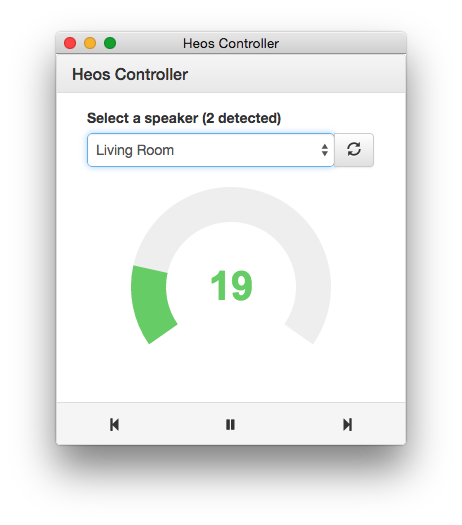

# Heos Controller
Desktop controller for [Denon Heos](http://heosbydenon.denon.com) wifi speakers.

## Screenshot

## Features
* Automatic detection of speakers
* User friendly volume dial
* Playback controls (previous, play/pause, next)

## Usage
0. Download a release and place it into your Applications directory
0. Run the app and wait for speaker detection
0. Select a speaker from the dropdown and use the controls

## Development
0. Clone this repo
0. Install all the node and bower packages using the `npm run setup` command
0. Run the app using `npm start` or `gulp`
0. To preview changes made in the *app* directory while the app is running, refresh with the (cmd-r) hot key
0. Dev tools are available using the (cmd-opt-i) hot key

## ToDo
* Detection and control of grouped speakers
* Details about the currently playing stream
* A slider to scrub and track playback position
* A "sources" media stream picker